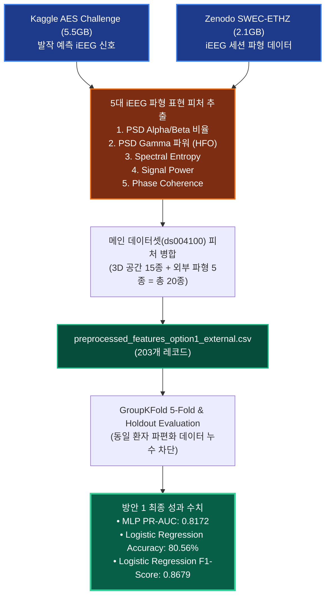
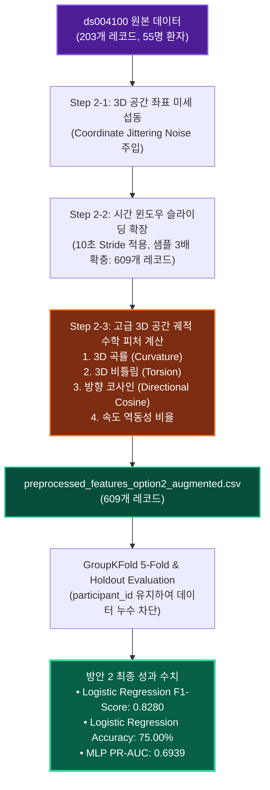
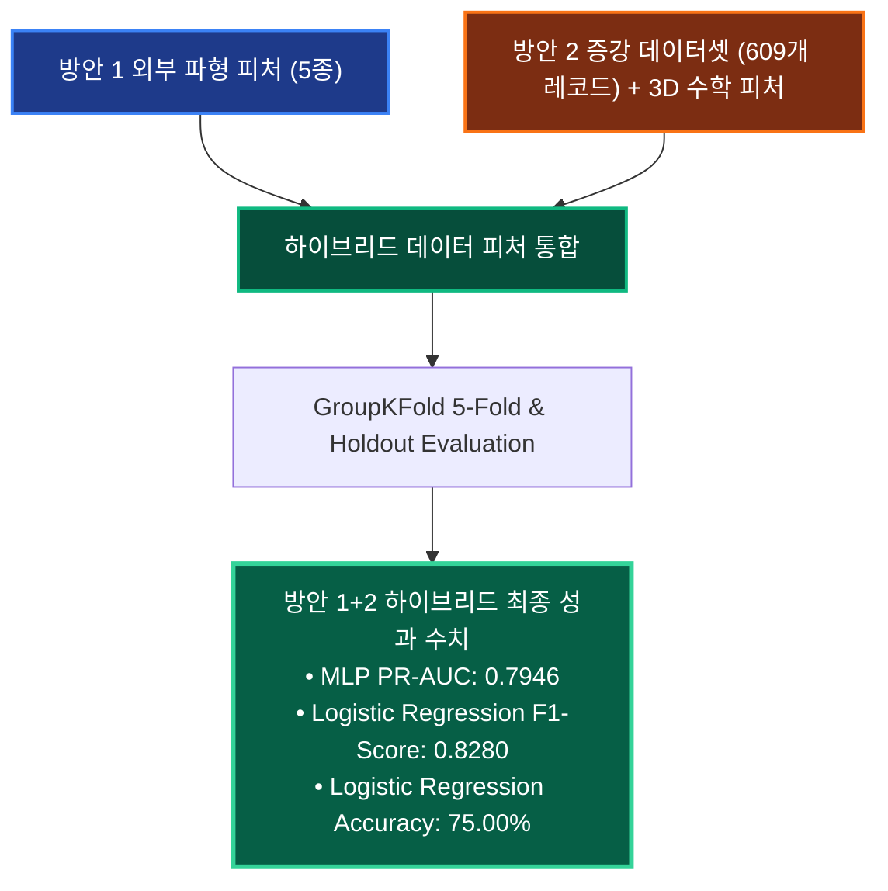

# 뇌전증 데이터셋 한계 극복 3대 실험 프로세스 다이어그램

## 1. 방안 1: 캐글(Kaggle) & Zenodo(SWEC-ETHZ) 외부 데이터 결합 파이프라인

```mermaid
flowchart TD
    Kaggle["Kaggle AES Challenge (5.5GB)<br>발작 예측 iEEG 신호"] --> FE["5대 iEEG 파형 표현 피처 추출<br>1. PSD Alpha/Beta 비율<br>2. PSD Gamma 파워 (HFO)<br>3. Spectral Entropy<br>4. Signal Power<br>5. Phase Coherence"]
    Zenodo["Zenodo SWEC-ETHZ (2.1GB)<br>iEEG 세션 파형 데이터"] --> FE
    
    FE --> Fusion["메인 데이터셋(ds004100) 피처 병합<br>(3D 공간 15종 + 외부 파형 5종 = 총 20종)"]
    Fusion --> Opt1CSV["preprocessed_features_option1_external.csv<br>(203개 레코드)"]
    Opt1CSV --> GKF1["GroupKFold 5-Fold & Holdout Evaluation<br>(동일 환자 파편화 데이터 누수 차단)"]
    GKF1 --> Res1["방안 1 최종 성과 수치<br>• MLP PR-AUC: 0.8172<br>• Logistic Regression Accuracy: 80.56%<br>• Logistic Regression F1-Score: 0.8679"]

    style Kaggle fill:#1e3a8a,stroke:#3b82f6,stroke-width:2px,color:#ffffff
    style Zenodo fill:#1e3a8a,stroke:#3b82f6,stroke-width:2px,color:#ffffff
    style FE fill:#7c2d12,stroke:#f97316,stroke-width:2px,color:#ffffff
    style Opt1CSV fill:#064e3b,stroke:#10b981,stroke-width:2px,color:#ffffff
    style Res1 fill:#065f46,stroke:#34d399,stroke-width:3px,color:#ffffff
```

---

## 2. 방안 2: 데이터 증강 및 3D 공간 궤적 수학 피처 파이프라인

```mermaid
flowchart TD
    Raw["ds004100 원본 데이터<br>(203개 레코드, 55명 환자)"] --> Jitter["Step 2-1: 3D 공간 좌표 미세 섭동<br>(Coordinate Jittering Noise 주입)"]
    Jitter --> Overlap["Step 2-2: 시간 윈도우 슬라이딩 확장<br>(10초 Stride 적용, 샘플 3배 확충: 609개 레코드)"]
    Overlap --> Math["Step 2-3: 고급 3D 공간 궤적 수학 피처 계산<br>1. 3D 곡률 (Curvature)<br>2. 3D 비틀림 (Torsion)<br>3. 방향 코사인 (Directional Cosine)<br>4. 속도 역동성 비율"]
    Math --> Opt2CSV["preprocessed_features_option2_augmented.csv<br>(609개 레코드)"]
    Opt2CSV --> GKF2["GroupKFold 5-Fold & Holdout Evaluation<br>(participant_id 유지하여 데이터 누수 차단)"]
    GKF2 --> Res2["방안 2 최종 성과 수치<br>• Logistic Regression F1-Score: 0.8280<br>• Logistic Regression Accuracy: 75.00%<br>• MLP PR-AUC: 0.6939"]

    style Raw fill:#4c1d95,stroke:#8b5cf6,stroke-width:2px,color:#ffffff
    style Math fill:#7c2d12,stroke:#f97316,stroke-width:2px,color:#ffffff
    style Opt2CSV fill:#064e3b,stroke:#10b981,stroke-width:2px,color:#ffffff
    style Res2 fill:#065f46,stroke:#34d399,stroke-width:3px,color:#ffffff
```

---

## 3. 방안 1+2 하이브리드 결합 파이프라인

```mermaid
flowchart TD
    DataOpt1["방안 1 외부 파형 피처 (5종)"] --> HybFusion["하이브리드 데이터 피처 통합"]
    DataOpt2["방안 2 증강 데이터셋 (609개 레코드) + 3D 수학 피처"] --> HybFusion
    
    HybFusion --> GKF3["GroupKFold 5-Fold & Holdout Evaluation"]
    GKF3 --> Res3["방안 1+2 하이브리드 최종 성과 수치<br>• MLP PR-AUC: 0.7946<br>• Logistic Regression F1-Score: 0.8280<br>• Logistic Regression Accuracy: 75.00%"]

    style DataOpt1 fill:#1e3a8a,stroke:#3b82f6,stroke-width:2px,color:#ffffff
    style DataOpt2 fill:#7c2d12,stroke:#f97316,stroke-width:2px,color:#ffffff
    style HybFusion fill:#064e3b,stroke:#10b981,stroke-width:2px,color:#ffffff
    style Res3 fill:#065f46,stroke:#34d399,stroke-width:3px,color:#ffffff
```
